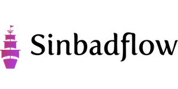

# Sinbadflow - simple pipeline creation and execution tool

Sinbadflow is a simple pipeline execution tool. It was created having Databricks notebooks workflow in mind, however with few small changes it can be customized to fit any task. Named after famous cartoon "Sinbad: Legend of the Seven Seas" it provides ability to run agents with specific triggers in parallel or single mode. With the simple and intuitive syntax we can create elaborative pipelines to help with any data engineering, data science or software development task.

## Instalation

To install use:

```pip install sinbadflow```

## Usage

Sinbadflow supports single or parallel run with different execution triggers. To build a pipeline use ```>>``` symbol between two agents. Example Databricks notebooks pipeline (one-by-one execution):

```python
from sinbadflow.agents import DatabricksAgent as dbr
from sinbadflow import Trigger

pipeline = dbr('/path/to/notebook1') >> dbr('path/to/another/notebook')
```
Parallel run pipeline (agents in list are executed in parallel mode):

```python
pipeline = dbr('/path/to/notebook') >> [dbr('/parallel_run_notebook'), dbr('/another_parallel')]
```

The flow can be also controlled by using triggers. Sinbadflow supports these triggers:

* ```Trigger.DEFAULT``` - default trigger, the agent is always executed.
* ```Trigger.OK_PREV``` - agent will be executed if previous agent finished successfully.
* ```Trigger.OK_ALL``` - agent will be executed if so far no fails are recorded in the pipeline.
* ```Trigger.FAIL_PREV``` - agent will be executed if previous agent run failed.
* ```Trigger.FAIL_ALL``` - agent will be executed if all previous runs failed.

An example workflow would look like this:

```python
pipeline = dbr('/execute') >> [dbr('/handle_ok', Trigger.OK_PREV), dbr('/handle_fail', Trigger.FAIL_PREV)] >> dbr('/save_all', Trigger.OK_ALL) >> dbr('/log_all_failed', Trigger.FAIL_ALL)
```
To run the pipeline:

```python
from sinbadflow import Sinbadflow

sf = Sinbadflow()

sf.run(pipeline)
```
The pipeline will be executed and results will be logged with selected method (```print/logging``` supported). Sinbadflow should always run the full pipeline, so far there is no implementation for stopping the pipeline if it fails. There should be at least two agents in the pipeline in order for it to work. If you want to run only one agent you can always create an empty agent in front of it, which will be skipped:

```python
one_element_pipeline = dbr() >> dbr('single_notebook_to_run')
```

## Customization

Sinbadflow also let's you create your own agents. In order to do that, your agent must inherit from ```BaseAgent``` class, pass the ```data``` parameter to parent class and implement ```run()``` method. An example ```DummyAgent```:

```python
from sinbadflow.agents import BaseAgent
from sinbadflow import Trigger

class DummyAgent(BaseAgent):
    def __init__(self, data, trigger = Trigger.DEFAULT):
        super(DummyAgent, self).__init__(data, trigger)

    def run(self):
        print(f'Running my DummyAgent with data: {data}')


pipeline = DummyAgent('secret_data') >> [DummyAgent('simple_data'), DummyAgent('important_data')]

sf.run(pipeline)
```

## Additional help

Use built in ```help()``` method for additional information. Do not hesitate to contact me with any question. Pull requests are encouraged!